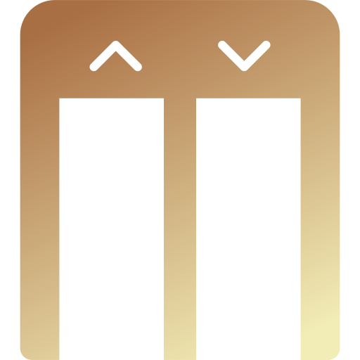
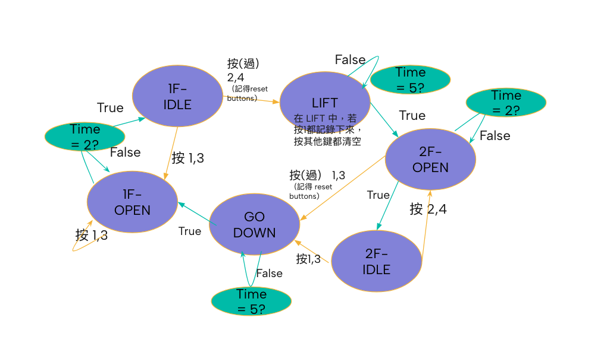

<!-- Improved compatibility of back to top link: See: https://github.com/othneildrew/Best-README-Template/pull/73 -->
<a id="readme-top"></a>
<!--
*** Thanks for checking out the Best-README-Template. If you have a suggestion
*** that would make this better, please fork the repo and create a pull request
*** or simply open an issue with the tag "enhancement".
*** Don't forget to give the project a star!
*** Thanks again! Now go create something AMAZING! :D
-->


<!-- PROJECT SHIELDS -->
<!--
*** I'm using markdown "reference style" links for readability.
*** Reference links are enclosed in brackets [ ] instead of parentheses ( ).
*** See the bottom of this document for the declaration of the reference variables
*** for contributors-url, forks-url, etc. This is an optional, concise syntax you may use.
*** https://www.markdownguide.org/basic-syntax/#reference-style-links
-->
<!-- [![Contributors][contributors-shield]][contributors-url]
[![Forks][forks-shield]][forks-url]
[![Stargazers][stars-shield]][stars-url]
[![Issues][issues-shield]][issues-url]
[![MIT License][license-shield]][license-url]
[![LinkedIn][linkedin-shield]][linkedin-url] -->


<!-- PROJECT LOGO -->
<br />
<div align="center">
  <a href="https://github.com/github_username/repo_name">
    
  </a>

<h3 align="center">TCP Elevator</h3>

  <p align="center">
    A 2-floor TCP Elevator <br />
  </p>
</div>


<!-- TABLE OF CONTENTS -->
<details>
  <summary>Table of Contents</summary>
  <ol>
  <li><a href="#demo">Demo</a></li>
    <li>
      <a href="#about-the-project">About The Project</a>
    </li>
    <li>
      <a href="#getting-started">Getting Started</a>
      <ul>
        <li><a href="#installation">Installation</a></li>
      </ul>
    </li>
    <!-- <li><a href="#usage">Usage</a></li> -->
    <li><a href="#implementation">Implementation</a></li>
    <!-- <li><a href="#contributing">Contributing</a></li> -->
  </ol>
</details>

## Demo
https://github.com/user-attachments/assets/0a95b49a-0449-4b36-8e04-2639af2ca8fe

<!-- ABOUT THE PROJECT -->
## About The Project

1. This is a 2-floor simplified elevator. It  has two buttons on each floor and two buttons on the elevator panel. The elevator can lift up or go down between the two floors. Every lift-up or go-down action takes `5` second. Every opening takes `2` seconds.
2.  To control this elevator, a user will need to gain access to the service of the elevator by opening a TCP connection. Once the connection is granted, the user has 4 actions to choose from:
    - `1`: 1F button on the elevator panel is pressed
    - `2`: 2F button on the elevator panel is pressed
    - `3`: 1F elevator call button is pressed
    - `4`: 2F elevator call button is pressed
The user can take any action at any time (through keyboard). The elevator will respond to the button press accordingly.

<p align="right">(<a href="#readme-top">back to top</a>)</p>


<!-- ### Built With

* [![Next.js][Next.js]][Next-url]
* [![React][React.js]][React-url]
* [![Vue][Vue.js]][Vue-url]
* [![Angular][Angular.io]][Angular-url]
* [![Svelte][Svelte.dev]][Svelte-url]
* [![Laravel][Laravel.com]][Laravel-url]
* [![Bootstrap][Bootstrap.com]][Bootstrap-url]
* [![JQuery][JQuery.com]][JQuery-url] -->

<!-- <p align="right">(<a href="#readme-top">back to top</a>)</p> -->


<!-- GETTING STARTED -->
## Getting Started
<!-- This is an example of how you may give instructions on setting up your project locally.
To get a local copy up and running follow these simple example steps. -->
```
git clone https://github.com/Nana2929/TCP-Elevator.git
```
And then open two terminals, one for the server and the other for the client. Run the following commands in the respective terminals.
```
// for server (this needs to be run first to set up the service)
make
./server
// use `make clean` to clean the cache first and rebuild from scratch by running the above
```
```
// for client
g++ -o client src/elevator_client.cpp
./client
```

### Prerequisites
<!-- my c++ dev env and how to install them -->
This project requires a minimum of C++11 to run.

<!-- ### Installation

<p align="right">(<a href="#readme-top">back to top</a>)</p> -->

<!-- ROADMAP -->
## Implementation


The server is implemented using multi-threading.
- The server itself is a thread listening for client request buttons, implemented in `src/elevator_server/elevator_server.cpp`.
- The elevator runs 2 threads, one for printing out current state (`src/elevator_server/elevator.cpp printState()`) and the other for transiting the state (`src/elevator_server/elevator.cpp  stateTransit()`).
  ```cpp
  // ...
    static const int BTN_NUM = 4;
    const int OPEN_TIME = 2;
    const int MOVE_TIME = 5;
    State currState;
    std::time_t actTime = 0; // action time
    bool pressedBtns[BTN_NUM+1];
  // ...
  ```
### Members of `Elevator` class
  - `currState`: 6 states in total, marking the current state of the elevator (IDLE_1F, OPEN_1F, LIFT, IDLE_2f, OPEN_2F, GO_DOWN)
  - `pressedBtns`: an array of 5 elements, marking which action buttons are pressed by the user for later request service (1-indexed, first element is dummy)
  - `actTime`: the time when the last action was taken
### Multi-threading
- In which it could be observed that, `currState`and `pressedBtns` could be read and written by the *printing thread* and the *transiting thread*, so 2 mutexes are used to protect them; in practice I wrote them setters and getters for encapsulation. Furthermore, because a button press (and the subsequent state change) can happen in the middle of a second, which could cause the *printing thread* to miss out on printing the state (e.g. `OPEN` be printed just once instead of twice), I use a condition variable to notify the *printing thread* that the state has been updated, so that the printing count can be correctly displayed. Note that this could cause the *printing thread* to print out multiple states in one second if the state is updated multiple times in that second.
- Extra Members of `Elevator` class
  - `std::mutex mtx`: a mutex to protect the shared resource `currState` and `pressedBtns`
  - `std::condition_variable cv`: a condition variable to notify the threads that the shared resource has been updated
  - `std::unique_lock<std::mutex> lock(mtx)`: a lock called `lock` to protect the shared resource, the usage:
    - `cv.wait(lock)`: a wait to wait for the condition variable to be notified
    - `cv.notify_all()`: a notify to notify all the threads that the shared resource has been updated


<p align="right">(<a href="#readme-top">back to top</a>)</p>


<!-- ACKNOWLEDGMENTS -->
## Acknowledgments & References
* [Logo credit | Pop Vectors](https://www.flaticon.com/free-icon/elevator_11105995?term=elevator&page=1&position=30&origin=search&related_id=11105995)
- [Cpp ctp Linux Socket | Shengyu7697](https://shengyu7697.github.io/cpp-linux-tcp-socket/)


<p align="right">(<a href="#readme-top">back to top</a>)</p>


<!-- MARKDOWN LINKS & IMAGES -->
<!-- https://www.markdownguide.org/basic-syntax/#reference-style-links -->
[contributors-shield]: https://img.shields.io/github/contributors/github_username/repo_name.svg?style=for-the-badge
[contributors-url]: https://github.com/github_username/repo_name/graphs/contributors
[forks-shield]: https://img.shields.io/github/forks/github_username/repo_name.svg?style=for-the-badge
[forks-url]: https://github.com/github_username/repo_name/network/members
[stars-shield]: https://img.shields.io/github/stars/github_username/repo_name.svg?style=for-the-badge
[stars-url]: https://github.com/github_username/repo_name/stargazers
[issues-shield]: https://img.shields.io/github/issues/github_username/repo_name.svg?style=for-the-badge
[issues-url]: https://github.com/github_username/repo_name/issues
[license-shield]: https://img.shields.io/github/license/github_username/repo_name.svg?style=for-the-badge
[license-url]: https://github.com/github_username/repo_name/blob/master/LICENSE.txt
[linkedin-shield]: https://img.shields.io/badge/-LinkedIn-black.svg?style=for-the-badge&logo=linkedin&colorB=555
[linkedin-url]: https://linkedin.com/in/linkedin_username
[product-screenshot]: images/screenshot.png
[Next.js]: https://img.shields.io/badge/next.js-000000?style=for-the-badge&logo=nextdotjs&logoColor=white
[Next-url]: https://nextjs.org/
[React.js]: https://img.shields.io/badge/React-20232A?style=for-the-badge&logo=react&logoColor=61DAFB
[React-url]: https://reactjs.org/
[Vue.js]: https://img.shields.io/badge/Vue.js-35495E?style=for-the-badge&logo=vuedotjs&logoColor=4FC08D
[Vue-url]: https://vuejs.org/
[Angular.io]: https://img.shields.io/badge/Angular-DD0031?style=for-the-badge&logo=angular&logoColor=white
[Angular-url]: https://angular.io/
[Svelte.dev]: https://img.shields.io/badge/Svelte-4A4A55?style=for-the-badge&logo=svelte&logoColor=FF3E00
[Svelte-url]: https://svelte.dev/
[Laravel.com]: https://img.shields.io/badge/Laravel-FF2D20?style=for-the-badge&logo=laravel&logoColor=white
[Laravel-url]: https://laravel.com
[Bootstrap.com]: https://img.shields.io/badge/Bootstrap-563D7C?style=for-the-badge&logo=bootstrap&logoColor=white
[Bootstrap-url]: https://getbootstrap.com
[JQuery.com]: https://img.shields.io/badge/jQuery-0769AD?style=for-the-badge&logo=jquery&logoColor=white
[JQuery-url]: https://jquery.com